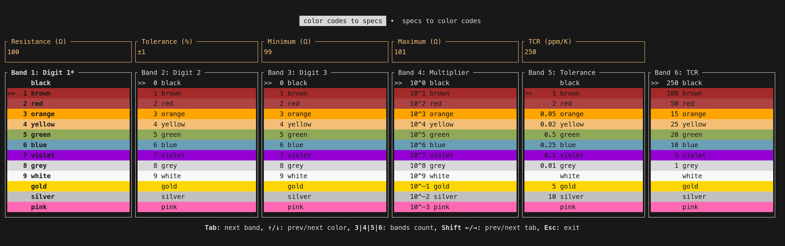

# tusistor

This is a [Ratatui] app to calculate the color codes and specs of electrical resistors.  
3, 4, 5 and 6 band resistors are supported.  
You can go from selected color codes to specs or from specs to color codes.  
The resistance input supports the RKM notation, e.g. `4k7`.  
The input of tolerance and/or TCR are optional depending on your resistance input.

[Ratatui]: https://ratatui.rs

## License

This project is licensed under the MIT license ([LICENSE] or <http://opensource.org/licenses/MIT>)

[LICENSE]: ./LICENSE
